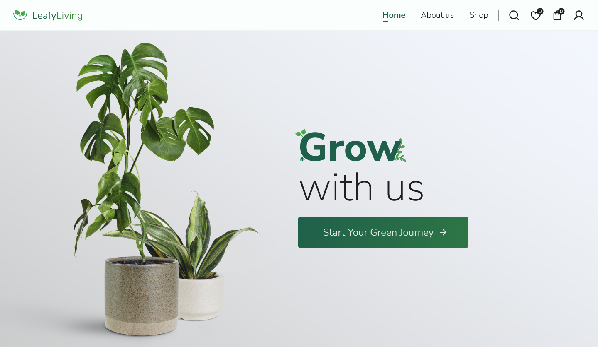
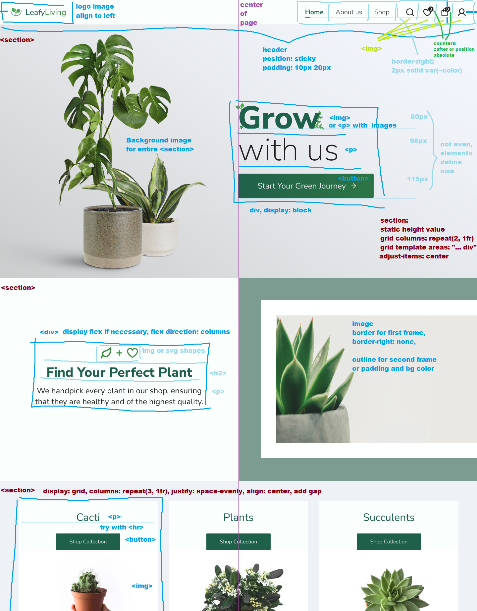
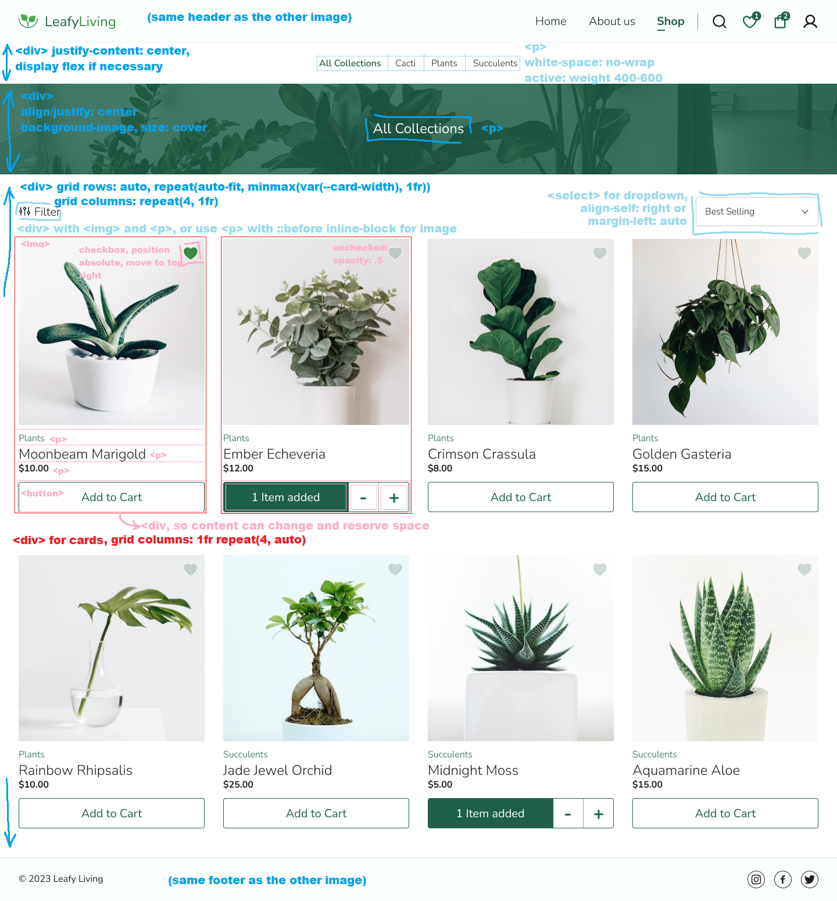
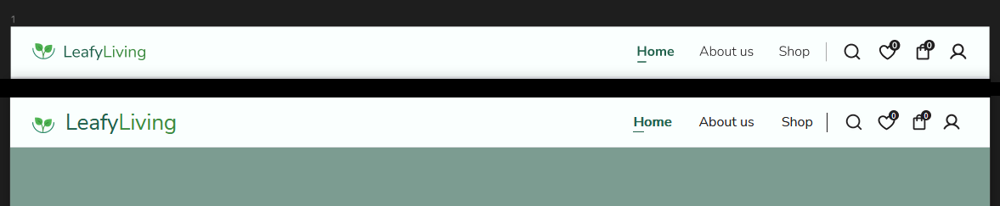
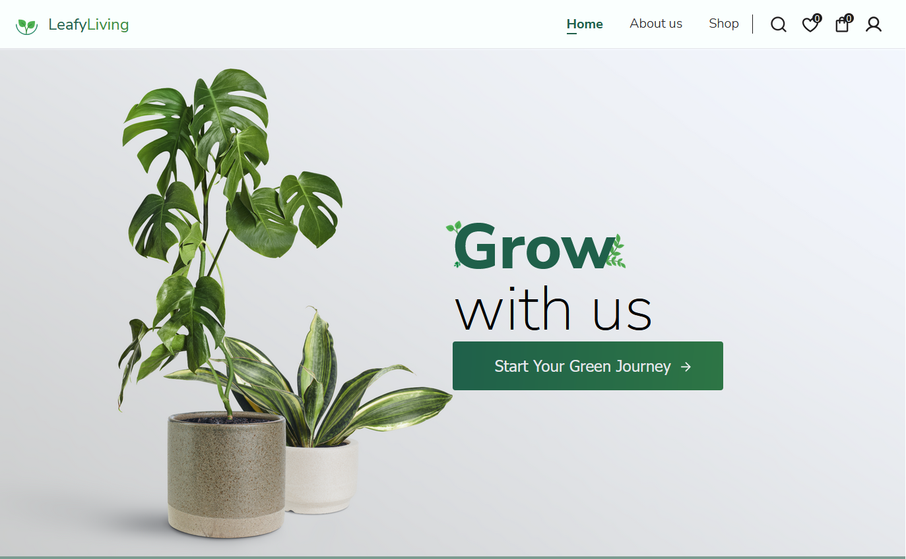
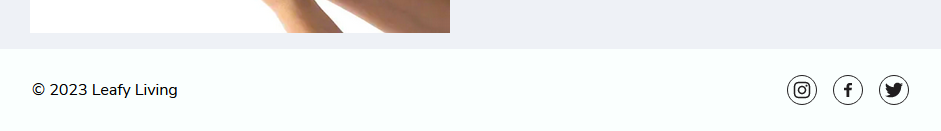
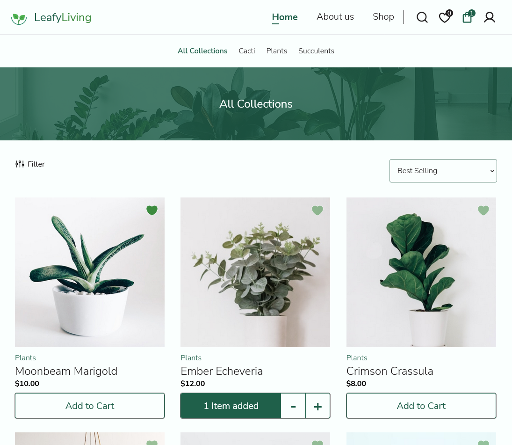
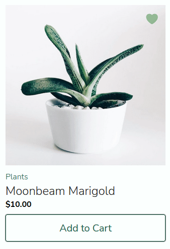

# How to Start?
In the terminal enter: python3 -m http.server 8080
Don't be dumb

# ecommerce-mockup
This project is just for practice, a little cooperation with a UX/UI friend.

Considering this is not a big project, I'll use plain `HTML`, `CSS` and `Javascript`, no webpack or libraries, unless I find it necessary.

# Live: https://hectorvilas.github.io/ecommerce-mockup/

# the page

>a screenshot from the original design

[Here](https://www.figma.com/proto/vXQGm1fvXxKtfNDDbsYDC4/LeafyLiving?page-id=0%3A1&node-id=3%3A4&viewport=0%2C0%2C1&scaling=scale-down&starting-point-node-id=3%3A4&show-proto-sidebar=1) is the mockup I'm going to use for this project. It's a landing page and the store section.

I still have to think what kind of approach I'm going to use. I didn't planned anything before creating this repository, so I'm going to scribble a little over the original design to organize everything and find the best way to keep the `CSS` as simple as possible. For the `Javascript` I'm probably going to use modules to prevent repetition, so I'll keep the `HTML` to the minimum.

The page needs to be reponsive. I didn't asked how it should look on mobile devices, so I'm going to try my own solution as a little challenge, then apply any necessary changes depending on the designer's opinion.

## update 1:
I've been scribbling over two screenshots, planning the best approach for this project, but felt a little unnecesary considering the simplicity of the pages. Then I noticed I can open the Figma mockup on the editor to get all the necessary information I need to make it a real page. Oh, well, here's what I did with the screenshots before noticing it:

Now I can start building the pages. I was considering changing the page's content (keeping the header and footer where they are) instead of loading another page. With modules it's going to be easier this way.

## update 2
Still not completely sure about how to approach some parts of the page, I tried to recreate the `SVG`-like elements on the Figma project, but it was too much work for something so simple like icons. After experimenting with `SVG`'s `path`s and InkScape, I decided to simply export the icons directly from Figma as PNG images (asd SVG got errors). The result feels like the same, so I'll keep it like that unless necessary.

The rest of the `<header>` elements were pretty straightfoward to add, I just checked the properties on Figma, like dimensions, font family and other things, then I had to do very little decisions on how to approach a few things.

I think the header is finished, here's what I got for now:

Original at top, my work at bottom. I'm missing a very subtle gradient, the vertical line has the wrong color (for subpixel reasons) and the `font-size` on the left is a little big, but that can be fixed easily.

## update 3
Today I worked with the hero section. Everything went smooth, except for the "grow" text, because the little leaves, but with a `<svg>`, with 3 `<image>` and a `<text>`, I solved the problem quite easily.

The page now looks quite similar to the mockup and I'm happy with how this project is going. Here is what I got for now:

## update 4
The footer has been added:

Then I've been working with the shop part:

I did my best copying every single element from the mockup, so it's almost pixel perfect. I paid attention to all fonts, font weights, colors, borders, distance on pixels between elements, etc.

The part that took me more time was making the cards:

I added a few animations on it, I'm not sure if I should leave it or not. For the button I used advanced `CSS` selectors and some metadata, so the "-" and "+" buttons shows only when there's at least one of the current article in the cart, the same did for the colors on the main button, which gets disabled while the other buttons are present. With `Js` I changed the `textContent` of the button to show how much items from the article are in the cart.

The mockup is almost finished. Now I need to work in a few things:
- event listeners
- favorites count
- store the cart in localStorage
- make it responsive

About the responsiveness, I still have to contact the designer who made the page, so he can tell me how it should look on mobile. If I can't I'll just try to make it myself.

## update 5
I got carried away and forgot to update my progress. Since my last entry I:
- moved a few things to their own modules and CSS files
- added a listener to favorites, so the counter now works
- added some animations to the fav/cart counters
- made interactive elements for navigation actually change the page (just replaces the `<main>` content and scroll to top, it's a single page project)
- limited the width of the page for a better look on widescreens
- added responsiveness to the header
- made the `<nav>` a dropdown when viewport width is less than `800px`
- used a `<svg>` element for the burger button so it can mutate to an "X" when the menu is open
- centered the hero image so it moves away from the element at the right
- made the home responsive (it's layout changes a little, items at the right will be centered, and decorative images will now be a background).

Here's a GIF showing the page at 480x800 pixels of resolution:

I don't have any references for the `:hover`, so I'll skip this for now.

I think the mockup is finished. I want to use `localStorage` to simulate a shopping cart, to keep the counters updated when going back to the shop section.